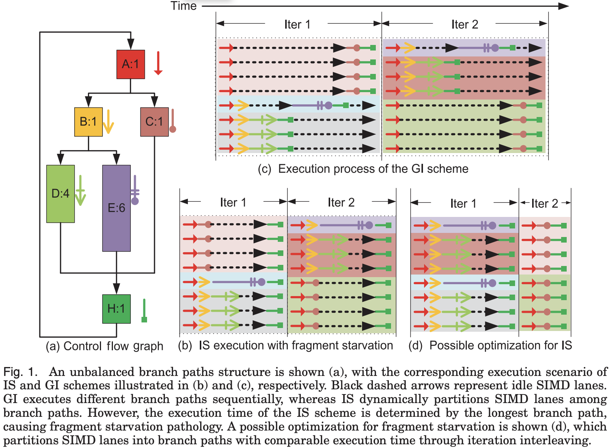

# Design

1. Declare resource constraints (executors, containers, etc)
2. Group nodes into basic blocks, essentially several nodes that are all required to complete for another basic block to begin
3. Create interference graph for each basic block
4. Mark node interferences based on dependencies
5. Colour graph based on resources
6. Execute graph with resources

## Components

* Instruction Buffer Array (IBA)
* Instruction Shuffle Unit (ISU)
* Pending Lane Buffer (PLB)

## Execution Behaviour

1. Statically analyse graph, categorise branch paths by length into $k$ groups via k-means clustering. A branch path is from divergence to re-convergence.
2. Encode branch paths according to their size and push them into the associated buffers in IBA.

Note: This is essentially the [strip-packing problem](https://en.wikipedia.org/wiki/Strip_packing_problem), which is known
to be strongly-NP hard. and there exists no polynomial time approximation algorithm with a ratio smaller than $\frac{3}{2}$
unless P = NP. However, the best approximation ratio achieved so far (by a polynomial time algorithm by Harren et al.) is
(\frac{5}{3}+\varepsilon), imposing an open question whether there is an algorithm with approximation ratio $\frac{3}{2}$.

### Pre-execution Pipelining

A task that is waiting for one or more dependent tasks to complete, with results pushed into 
deques in each edge (`Pipe`), can be allocated a thread in a pre-execution state (name TBC), which can 
invoke the methods in the `Consolidatable` interface to collect results ahead of time to prevent waiting 
for consolidation to happen at task start up. This can also apply to forwarding of results (`Splittable` interface)
to the next tasks dependent on the current one, using inverse logic (??).

Possibly allow for tasks to be marked as barriers or pipelined to determine if instead of pre-execution consolidation,
the incoming batches from each connected pipe can be invoked in the task as soon as an allocatable resource is free.

Allow for policies to be specified that determines how batches are pulled from connected pipes and in what order, this
allows for customisation. Transparency to pipe object properties should be visible to this policy interface.

## References

[Iteration Interleaving-Based SIMD Lane Partitioning](https://dl.acm.org/doi/pdf/10.1145/2847253)